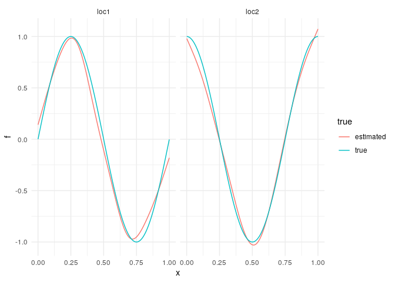

# liesel-template: Quarto example

## Generate some data

Generate five covariates with non-linear effects on the marginal means
and linear effects on the marginal standard deviations and the
correlation parameter of a bivariate normal response variable.

``` r
set.seed(1337)

n <- 1000

x1 <- runif(n)
x2 <- runif(n)
x3 <- runif(n)
x4 <- runif(n)
x5 <- runif(n)

y <- vapply(1:n, function(i) {
  loc1 <- sin(2 * pi * x1[i])
  loc2 <- cos(2 * pi * x2[i])
  scale1 <- exp(x3[i])
  scale2 <- exp(x4[i])
  cor <- tanh(x5[i])

  mu <- c(loc1, loc2)
  cov <- scale1 * scale2 * cor
  sigma <- matrix(c(scale1^2, cov, cov, scale2^2), nrow = 2)
  mvrnorm(1, mu, sigma)
}, FUN.VALUE = c(0, 0))

y <- t(y)
```

## Configure semi-parametric distributional regression model

Configure the correct data-generating model using RLiesel.

``` r
model <- liesel(
  response = y,
  distribution = py$BivariateNormal,
  predictors = list(
    loc1 = predictor(~s(x1), inverse_link = "Identity"),
    loc2 = predictor(~s(x2), inverse_link = "Identity"),
    scale1 = predictor(~x3, inverse_link = "Exp"),
    scale2 = predictor(~x4, inverse_link = "Exp"),
    cor = predictor(~x5, inverse_link = "Tanh")
  )
)
```

    Installed Liesel version 0.2.4 is compatible, continuing to set up model

## Run MCMC sampler

This MCMC sampler uses IWLS kernels for the regression coefficients and
Gibbs kernels for the smoothing parameters.

``` python
builder = lsl.dist_reg_mcmc(r.model, seed=1337, num_chains=4)
builder.set_duration(warmup_duration=1000, posterior_duration=1000)

engine = builder.build()
```

    liesel.goose.engine - INFO - Initializing kernels...
    liesel.goose.engine - INFO - Done

``` python
engine.sample_all_epochs()
```

    liesel.goose.engine - INFO - Starting epoch: FAST_ADAPTATION, 75 transitions, 25 jitted together
    liesel.goose.engine - INFO - Finished epoch
    liesel.goose.engine - INFO - Starting epoch: SLOW_ADAPTATION, 25 transitions, 25 jitted together
    liesel.goose.engine - INFO - Finished epoch
    liesel.goose.engine - INFO - Starting epoch: SLOW_ADAPTATION, 50 transitions, 25 jitted together
    liesel.goose.engine - INFO - Finished epoch
    liesel.goose.engine - INFO - Starting epoch: SLOW_ADAPTATION, 100 transitions, 25 jitted together
    liesel.goose.engine - INFO - Finished epoch
    liesel.goose.engine - INFO - Starting epoch: SLOW_ADAPTATION, 200 transitions, 25 jitted together
    liesel.goose.engine - WARNING - Errors per chain for kernel_01: 0, 0, 1, 0 / 200 transitions
    liesel.goose.engine - INFO - Finished epoch
    liesel.goose.engine - INFO - Starting epoch: SLOW_ADAPTATION, 500 transitions, 25 jitted together
    liesel.goose.engine - WARNING - Errors per chain for kernel_00: 0, 1, 0, 0 / 500 transitions
    liesel.goose.engine - INFO - Finished epoch
    liesel.goose.engine - INFO - Starting epoch: FAST_ADAPTATION, 50 transitions, 25 jitted together
    liesel.goose.engine - INFO - Finished epoch
    liesel.goose.engine - INFO - Finished warmup
    liesel.goose.engine - INFO - Starting epoch: POSTERIOR, 1000 transitions, 25 jitted together
    liesel.goose.engine - INFO - Finished epoch

``` python

results = engine.get_results()
summary = gs.Summary(results)
```

``` python
summary
```

<p>
<strong>Parameter summary:</strong>
</p>
<table border="0" class="dataframe">
<thead>
<tr style="text-align: right;">
<th>
</th>
<th>
</th>
<th>
kernel
</th>
<th>
mean
</th>
<th>
sd
</th>
<th>
q_0.05
</th>
<th>
q_0.5
</th>
<th>
q_0.95
</th>
<th>
sample_size
</th>
<th>
ess_bulk
</th>
<th>
ess_tail
</th>
<th>
rhat
</th>
</tr>
<tr>
<th>
parameter
</th>
<th>
index
</th>
<th>
</th>
<th>
</th>
<th>
</th>
<th>
</th>
<th>
</th>
<th>
</th>
<th>
</th>
<th>
</th>
<th>
</th>
<th>
</th>
</tr>
</thead>
<tbody>
<tr>
<th rowspan="2" valign="top">
cor_p0_beta
</th>
<th>
(0,)
</th>
<td>
kernel_00
</td>
<td>
0.016
</td>
<td>
0.059
</td>
<td>
-0.082
</td>
<td>
0.017
</td>
<td>
0.114
</td>
<td>
4000
</td>
<td>
873.971
</td>
<td>
1121.703
</td>
<td>
1.005
</td>
</tr>
<tr>
<th>
(1,)
</th>
<td>
kernel_00
</td>
<td>
0.969
</td>
<td>
0.099
</td>
<td>
0.807
</td>
<td>
0.968
</td>
<td>
1.132
</td>
<td>
4000
</td>
<td>
833.509
</td>
<td>
1241.964
</td>
<td>
1.007
</td>
</tr>
<tr>
<th rowspan="9" valign="top">
loc1_np0_beta
</th>
<th>
(0,)
</th>
<td>
kernel_07
</td>
<td>
-1.227
</td>
<td>
3.065
</td>
<td>
-6.655
</td>
<td>
-0.966
</td>
<td>
3.175
</td>
<td>
4000
</td>
<td>
431.890
</td>
<td>
509.292
</td>
<td>
1.007
</td>
</tr>
<tr>
<th>
(1,)
</th>
<td>
kernel_07
</td>
<td>
-1.936
</td>
<td>
2.402
</td>
<td>
-6.154
</td>
<td>
-1.774
</td>
<td>
1.739
</td>
<td>
4000
</td>
<td>
439.891
</td>
<td>
782.927
</td>
<td>
1.006
</td>
</tr>
<tr>
<th>
(2,)
</th>
<td>
kernel_07
</td>
<td>
1.504
</td>
<td>
2.250
</td>
<td>
-2.151
</td>
<td>
1.441
</td>
<td>
5.314
</td>
<td>
4000
</td>
<td>
461.085
</td>
<td>
843.623
</td>
<td>
1.006
</td>
</tr>
<tr>
<th>
(3,)
</th>
<td>
kernel_07
</td>
<td>
-1.380
</td>
<td>
1.477
</td>
<td>
-3.820
</td>
<td>
-1.371
</td>
<td>
0.988
</td>
<td>
4000
</td>
<td>
356.035
</td>
<td>
807.946
</td>
<td>
1.013
</td>
</tr>
<tr>
<th>
(4,)
</th>
<td>
kernel_07
</td>
<td>
0.226
</td>
<td>
1.682
</td>
<td>
-2.604
</td>
<td>
0.223
</td>
<td>
2.956
</td>
<td>
4000
</td>
<td>
539.462
</td>
<td>
917.585
</td>
<td>
1.008
</td>
</tr>
<tr>
<th>
(5,)
</th>
<td>
kernel_07
</td>
<td>
-0.887
</td>
<td>
0.692
</td>
<td>
-2.009
</td>
<td>
-0.905
</td>
<td>
0.277
</td>
<td>
4000
</td>
<td>
433.974
</td>
<td>
702.239
</td>
<td>
1.012
</td>
</tr>
<tr>
<th>
(6,)
</th>
<td>
kernel_07
</td>
<td>
-5.190
</td>
<td>
0.771
</td>
<td>
-6.444
</td>
<td>
-5.169
</td>
<td>
-3.955
</td>
<td>
4000
</td>
<td>
378.453
</td>
<td>
733.783
</td>
<td>
1.014
</td>
</tr>
<tr>
<th>
(7,)
</th>
<td>
kernel_07
</td>
<td>
0.020
</td>
<td>
1.303
</td>
<td>
-2.182
</td>
<td>
0.034
</td>
<td>
2.089
</td>
<td>
4000
</td>
<td>
480.138
</td>
<td>
789.277
</td>
<td>
1.006
</td>
</tr>
<tr>
<th>
(8,)
</th>
<td>
kernel_07
</td>
<td>
-1.223
</td>
<td>
0.538
</td>
<td>
-2.104
</td>
<td>
-1.200
</td>
<td>
-0.365
</td>
<td>
4000
</td>
<td>
405.578
</td>
<td>
652.605
</td>
<td>
1.014
</td>
</tr>
<tr>
<th>
loc1_np0_tau2
</th>
<th>
()
</th>
<td>
kernel_06
</td>
<td>
10.840
</td>
<td>
9.982
</td>
<td>
2.991
</td>
<td>
8.082
</td>
<td>
27.415
</td>
<td>
4000
</td>
<td>
703.159
</td>
<td>
1547.420
</td>
<td>
1.003
</td>
</tr>
<tr>
<th>
loc1_p0_beta
</th>
<th>
(0,)
</th>
<td>
kernel_08
</td>
<td>
0.062
</td>
<td>
0.042
</td>
<td>
-0.008
</td>
<td>
0.061
</td>
<td>
0.133
</td>
<td>
4000
</td>
<td>
889.307
</td>
<td>
1800.245
</td>
<td>
1.003
</td>
</tr>
<tr>
<th rowspan="9" valign="top">
loc2_np0_beta
</th>
<th>
(0,)
</th>
<td>
kernel_04
</td>
<td>
-0.331
</td>
<td>
2.455
</td>
<td>
-4.503
</td>
<td>
-0.304
</td>
<td>
3.610
</td>
<td>
4000
</td>
<td>
410.792
</td>
<td>
942.837
</td>
<td>
1.015
</td>
</tr>
<tr>
<th>
(1,)
</th>
<td>
kernel_04
</td>
<td>
0.048
</td>
<td>
2.138
</td>
<td>
-3.549
</td>
<td>
0.077
</td>
<td>
3.470
</td>
<td>
4000
</td>
<td>
487.461
</td>
<td>
600.749
</td>
<td>
1.007
</td>
</tr>
<tr>
<th>
(2,)
</th>
<td>
kernel_04
</td>
<td>
0.938
</td>
<td>
2.403
</td>
<td>
-2.818
</td>
<td>
0.837
</td>
<td>
5.249
</td>
<td>
4000
</td>
<td>
366.788
</td>
<td>
787.060
</td>
<td>
1.020
</td>
</tr>
<tr>
<th>
(3,)
</th>
<td>
kernel_04
</td>
<td>
-0.203
</td>
<td>
1.571
</td>
<td>
-2.729
</td>
<td>
-0.216
</td>
<td>
2.401
</td>
<td>
4000
</td>
<td>
409.176
</td>
<td>
858.454
</td>
<td>
1.010
</td>
</tr>
<tr>
<th>
(4,)
</th>
<td>
kernel_04
</td>
<td>
1.412
</td>
<td>
1.547
</td>
<td>
-1.097
</td>
<td>
1.383
</td>
<td>
4.080
</td>
<td>
4000
</td>
<td>
537.826
</td>
<td>
971.141
</td>
<td>
1.004
</td>
</tr>
<tr>
<th>
(5,)
</th>
<td>
kernel_04
</td>
<td>
-5.064
</td>
<td>
0.785
</td>
<td>
-6.369
</td>
<td>
-5.063
</td>
<td>
-3.780
</td>
<td>
4000
</td>
<td>
340.735
</td>
<td>
702.605
</td>
<td>
1.006
</td>
</tr>
<tr>
<th>
(6,)
</th>
<td>
kernel_04
</td>
<td>
-0.185
</td>
<td>
0.748
</td>
<td>
-1.427
</td>
<td>
-0.171
</td>
<td>
1.016
</td>
<td>
4000
</td>
<td>
436.423
</td>
<td>
832.889
</td>
<td>
1.005
</td>
</tr>
<tr>
<th>
(7,)
</th>
<td>
kernel_04
</td>
<td>
0.402
</td>
<td>
1.251
</td>
<td>
-1.560
</td>
<td>
0.352
</td>
<td>
2.550
</td>
<td>
4000
</td>
<td>
402.886
</td>
<td>
948.729
</td>
<td>
1.007
</td>
</tr>
<tr>
<th>
(8,)
</th>
<td>
kernel_04
</td>
<td>
-0.017
</td>
<td>
0.463
</td>
<td>
-0.778
</td>
<td>
-0.011
</td>
<td>
0.730
</td>
<td>
4000
</td>
<td>
443.861
</td>
<td>
780.769
</td>
<td>
1.006
</td>
</tr>
<tr>
<th>
loc2_np0_tau2
</th>
<th>
()
</th>
<td>
kernel_03
</td>
<td>
8.655
</td>
<td>
7.228
</td>
<td>
2.409
</td>
<td>
6.551
</td>
<td>
21.954
</td>
<td>
4000
</td>
<td>
864.550
</td>
<td>
1824.050
</td>
<td>
1.002
</td>
</tr>
<tr>
<th>
loc2_p0_beta
</th>
<th>
(0,)
</th>
<td>
kernel_05
</td>
<td>
0.033
</td>
<td>
0.044
</td>
<td>
-0.039
</td>
<td>
0.034
</td>
<td>
0.106
</td>
<td>
4000
</td>
<td>
770.817
</td>
<td>
1236.018
</td>
<td>
1.002
</td>
</tr>
<tr>
<th rowspan="2" valign="top">
scale1_p0_beta
</th>
<th>
(0,)
</th>
<td>
kernel_02
</td>
<td>
-0.111
</td>
<td>
0.042
</td>
<td>
-0.178
</td>
<td>
-0.112
</td>
<td>
-0.040
</td>
<td>
4000
</td>
<td>
927.015
</td>
<td>
1528.773
</td>
<td>
1.002
</td>
</tr>
<tr>
<th>
(1,)
</th>
<td>
kernel_02
</td>
<td>
1.198
</td>
<td>
0.075
</td>
<td>
1.074
</td>
<td>
1.198
</td>
<td>
1.323
</td>
<td>
4000
</td>
<td>
916.404
</td>
<td>
1634.647
</td>
<td>
1.003
</td>
</tr>
<tr>
<th rowspan="2" valign="top">
scale2_p0_beta
</th>
<th>
(0,)
</th>
<td>
kernel_01
</td>
<td>
-0.048
</td>
<td>
0.042
</td>
<td>
-0.116
</td>
<td>
-0.048
</td>
<td>
0.020
</td>
<td>
4000
</td>
<td>
797.034
</td>
<td>
1341.430
</td>
<td>
1.007
</td>
</tr>
<tr>
<th>
(1,)
</th>
<td>
kernel_01
</td>
<td>
1.001
</td>
<td>
0.072
</td>
<td>
0.882
</td>
<td>
1.001
</td>
<td>
1.120
</td>
<td>
4000
</td>
<td>
846.781
</td>
<td>
1545.197
</td>
<td>
1.004
</td>
</tr>
</tbody>
</table>
<p>
<strong>Error summary:</strong>
</p>
<table border="0" class="dataframe">
<thead>
<tr style="text-align: right;">
<th>
</th>
<th>
</th>
<th>
</th>
<th>
</th>
<th>
count
</th>
<th>
relative
</th>
</tr>
<tr>
<th>
kernel
</th>
<th>
error_code
</th>
<th>
error_msg
</th>
<th>
phase
</th>
<th>
</th>
<th>
</th>
</tr>
</thead>
<tbody>
<tr>
<th rowspan="2" valign="top">
kernel_00
</th>
<th rowspan="2" valign="top">
90
</th>
<th rowspan="2" valign="top">
nan acceptance prob
</th>
<th>
warmup
</th>
<td>
1
</td>
<td>
0.000
</td>
</tr>
<tr>
<th>
posterior
</th>
<td>
0
</td>
<td>
0.000
</td>
</tr>
<tr>
<th rowspan="2" valign="top">
kernel_01
</th>
<th rowspan="2" valign="top">
90
</th>
<th rowspan="2" valign="top">
nan acceptance prob
</th>
<th>
warmup
</th>
<td>
1
</td>
<td>
0.000
</td>
</tr>
<tr>
<th>
posterior
</th>
<td>
0
</td>
<td>
0.000
</td>
</tr>
</tbody>
</table>

## Visualize estimated splines

Compute estimated functions in Python…

``` python
x = r.model.vars["loc1_np0_X"].value
beta = summary.quantities["mean"]["loc1_np0_beta"]
loc1_hat = np.asarray(x @ beta)

x = r.model.vars["loc2_np0_X"].value
beta = summary.quantities["mean"]["loc2_np0_beta"]
loc2_hat = np.asarray(x @ beta)
```

… and plot them in R using ggplot2.

``` r
gg <- data.frame(
  x = c(x1, x1, x2, x2),
  f = c(sin(2 * pi * x1), py$loc1_hat, cos(2 * pi * x2), py$loc2_hat),
  true = rep(c("true", "estimated", "true", "estimated"), each = n),
  param = rep(c("loc1", "loc1", "loc2", "loc2"), each = n)
)

ggplot(gg) +
  geom_line(aes(x, f, color = true)) +
  facet_wrap(vars(param)) +
  theme_minimal()
```


